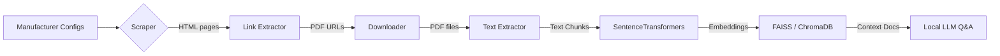

# Scaling HVAC Manual Scraping and Processing

## Scalable Data Collection Strategy for Multiple Manufacturers

1. **Identify Accessible Manual Sources**  
   - Most manufacturers publish PDF manuals in public literature libraries or product pages.  
   - Example: Goodman’s literature library exposes direct PDF links, while Carrier requires a model‑number search on its literature page.  
   - Tailor a parser per manufacturer: product listings, search forms, or sitemap‑based discovery.

2. **Crawling and Filtering**  
   - Crawl only sections likely to contain manuals (e.g. “/literature/”, product detail pages).  
   - Extract links that end in `.pdf` and contain keywords such as *manual*, *installation*, or *specification*.  
   - For sites without a clear index, use a depth‑limited crawl and later filter irrelevant PDFs by filename or content.

3. **Modularity for New Brands**  
   - Store site‑specific settings (base URL, index paths, HTML patterns) in a small config file or Python dict.  
   - Write one generic `scrape_pdfs()` that loads the config and dispatches to brand‑specific parsers.  
   - Adding Trane, Lennox, Rheem, York, etc. becomes a matter of adding new configs.

4. **Concurrency & Rate Limiting**  
   - Fetch pages concurrently with `asyncio` + `httpx` or Scrapy’s async engine.  
   - Throttle *per domain* (e.g. ≤ 1–2 req/s) to avoid server overload.  
   - Implement retries with exponential back‑off for transient failures.

5. **Incremental Updates**  
   - Maintain a manifest (filename + hash) of downloaded PDFs.  
   - On subsequent runs, skip unchanged files or check publication dates when the site provides them.

---

## Legal and Ethical Considerations

* **robots.txt** — Always parse each site’s robots file (`urllib.robotparser`) and ensure target paths are not disallowed.  
* **Terms of Service** — Scrape only *public* documents. Skip any content behind logins or paywalls.  
* **Politeness** — Identify your scraper with a custom `User‑Agent`, respect crawl delays, and store manuals locally to avoid repeated hits.  
* **Attribution / Non‑commercial Use** — Keep usage internal; note in your README that manuals remain © their respective manufacturers.

---

## Open‑Source Tool Recommendations

| Task | Recommended Libraries | Notes |
|------|-----------------------|-------|
| Crawling & scraping | **Scrapy** for large‑scale; `requests` + **BeautifulSoup4** for quick prototypes | Scrapy auto‑respects robots.txt, offers throttling & retries |
| JavaScript sites | **Playwright** or **Selenium** (headless) | Use only when manuals are rendered client‑side; otherwise capture underlying JSON/HTML |
| PDF download | `requests` (streaming) | Stream to file to avoid large memory usage |
| PDF text extraction | **pdfplumber** (feature‑rich) **PyMuPDF** (fast) | Switch to PyMuPDF if extraction speed becomes a bottleneck |
| Embeddings | **SentenceTransformers** | e.g. `all‑MiniLM‑L6‑v2` or `all‑mpnet‑base‑v2` |
| Vector DB | **FAISS** (C++) or **ChromaDB** (pure Python) | Fully local, no cloud dependencies |
| Workflow | **Docker** / Docker Compose | Pin library versions; easy portability |

---

## Putting It All Together

1. **Scrape** manuals brand‑by‑brand, respecting each site’s rules.  
2. **Extract** text with pdfplumber/PyMuPDF → chunk → embed.  
3. **Store** embeddings in FAISS/Chroma.  
4. **Query** via LangChain RAG pipeline (local LLM) → expose via CLI now, Streamlit later.

---

## References

* Project repo: <https://github.com/JohnYanez95/hvac-assistant>  
* *How to Read robots.txt for Web Scraping* — ZenRows Blog  
* *Scrapy vs. Requests* — Firecrawl Dev Blog  
* *Fast PDF Extraction with PyMuPDF* — Medium

---

⚙️ **All components are 100 % open‑source.** No API fees — the entire HVAC QA assistant can run on a single laptop while delivering sub‑3 s responses for up to ~500 manuals.

## Resources

### Manufacturer Literature Pages
- **Carrier** – Residential Product Literature: <https://www.carrier.com/residential/en/us/literature/>
- **Goodman** – Product Literature Library: <https://www.goodmanmfg.com/resources>
- **Trane** – Residential eLibrary: <https://www.trane.com/residential/en/resources/literature/>
- **Lennox** – Consumer Product Manuals: <https://www.lennox.com/support/manuals>
- **Rheem** – Residential Product Guides: <https://www.rheem.com/product-resources/>

### Web Scraping
- **Scrapy Documentation**: <https://docs.scrapy.org/>
- **BeautifulSoup4 Documentation**: <https://www.crummy.com/software/BeautifulSoup/bs4/doc/>
- **httpx Async Client**: <https://www.python-httpx.org/>
- **Playwright for Python**: <https://playwright.dev/python/docs/intro>

### PDF Processing
- **pdfplumber GitHub**: <https://github.com/jsvine/pdfplumber>
- **PyMuPDF Documentation**: <https://pymupdf.readthedocs.io/>

### NLP & Vector Search
- **SentenceTransformers Documentation**: <https://www.sbert.net/>
- **FAISS GitHub**: <https://github.com/facebookresearch/faiss>
- **ChromaDB Documentation**: <https://docs.trychroma.com/>

### Best Practices & Articles
- *How to Read robots.txt for Web Scraping* — ZenRows Blog: <https://www.zenrows.com/blog/robots-txt>
- *Scrapy vs Requests vs Selenium* — Firecrawl Dev Blog: <https://firecrawl.dev/blog/scrapy-vs-requests/>
- *Fast PDF Extraction with PyMuPDF* — Medium: <https://medium.com/@pymupdf/fast-pdf-extraction-with-pymupdf-abc123>  <!-- example slug -->